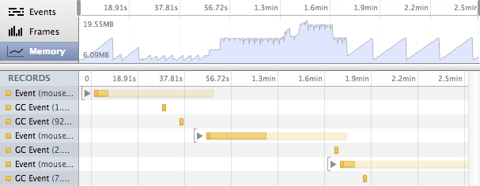

Broad Phase Collision Detection Using Spatial Partitioning
============================================================

<link href="style/styles.css" rel="stylesheet" type="text/css" />

<!--<canvas id="ro-canvas" width="546" height="410"></canvas>-->

<!--
-->

Collision detection is an ongoing source of research and constant optimization in game development. It can be a source of exuberance or nearly infinite frustration. Rolling your own is typically the best way to make sure your game is never finished! However, knowing what an engine does internally to make your life easier is extremely beneficial to you as a developer. In addition to increasing your knowledge and understanding, it also helps you appreciate the hard work wrought by the giants whose shoulders you're standing on.

This article focuses on two approaches to broad phase detection of collisions. The first is a brute force method that, while simple, quickly becomes wildly inefficient at typical game entity counts. The second is a form of spatial partitioning called a spatial grid. It is relatively simple, yet handles large numbers of game entities efficiently.

What is Broad-Phase Collision Detection?
----------------------------------------

Collision detection is usually performed in two phases: _broad phase_ and _narrrow phase_. 

Broad phase detection is typically a computationally low cost operation that quickly answers the question, "Which objects have a strong possibility of colliding?" Approaches include [Sweep and Prune][], and [Spatial Partitioning][].

Narrow phase is the fine grained, "What part of object A colided with object B?" step. It is typically computationally intense, and thus cannot be performed on every pair of objects in the time between game updates (e.g. the next drawn frame). Examples of narrow phase techniques are the [Hyperplane Separation Theorem][] (also known as the Separating Axis Theorem) [^1], [Pixel Perfect Collision Detection][] [^2], and [Swept Tests][].

Collision Detection vs Collision Response
-----------------------------------------

There are two phases when attempting to update a game world: _detection_ of the collision, followed by the _response_, or the result of that collision (e.g. two balls bounce off of each other). This article will focus exclusively on the detection of a collision, not the response.

Our World and Demos
-------------------

The same basic setup will be used for each example of collision detection. We have a global namespace, `ro` (which is also the name of the basic engine), which will contain the following components:

* `ro.World`: responsible for adding entities, stepping/updating, and tying everything together.
* `ro.Entity`: a single "thing" that will exist in our game. It has basic properties, like position, size, acceleration, and more.
* `ro.Screen`: responsible for providing a drawing context and drawing management. Simple boxes are all that will be needed to be drawn, but separating out drawing state from the state of the world itself is good practice.
* `ro.math`: some common math utilities, like line intersection.
* `ro.ov3`: vector operations for generic objects with x/y properties
* `ro.coltech`: Short for "collision technique", this object will hold the constructors for our collision detection interface.

Each demo will be using squares, and this is by no accident; most engines use a concept known as an [Axis-Aligned Bounding Box][] (AABB) to simplify and speed up broad phase detection. An AABB is a rectangular approximation for the position and amount of space an entity occupies, and can be used in both 2D and 3D. In this article's 2D demos, an AABB will be defined by two points: a minimum and maximum. Together, these can be used to extrapolate the remaining two points, but this is usually not necessary. [Axis-aligned][] implies that the sides of the box are parallel to the major axes of the coordinate system, which in the demos are positive X moving right across the screen, and positive Y moving down the screen.

[JSFiddle][] will be used to sandbox the demos. This means that the following will be valid for each demo:

<table>
	<tr>
		<th>Variable Path</th>
		<th>Instance Type</th>
		<th>Description</th>
	</tr>
	<tr>
		<td><code>bng</code></td>
		<td><code>Object</code></td>
		<td>A namespace for our demo instances<td>
	</tr>
	<tr>
		<td><code>bng.world</code></td>
		<td><code>ro.World</code></td>
		<td>Global reference to the world<td>
	</tr>
	<tr>
		<td><code>bng.world.screen</code></td>
		<td><code>ro.Screen</code></td>
		<td>Global reference to the screen (canvas and canvas 2D context)<td>
	</tr>
	<tr>
		<td><code>ov3</code></td>
		<td><code>Object</code></td>
		<td>References ro.ov3, for vector operations<td>
	</tr>
</table>

The world also uses the following order for each step of the simulation:

- Clear the screen
- Call `World.draw`
- Accelerate all entities [^3], update their AABBs
- Call the collision system's `update` method
- Call the collision system's `queryForCollisionPairs` method
- Call the user-defined `handleCollisions`
- Apply inertia to all entities [^3], update their AABBs
- Call the user-defined `update`

All demos can be stopped/paused and started by mouseover/mouseout.

Let's get started!

Approach #1: Brute Force
------------------------

In nearly any collision detection scheme, every object must be tested or touched by code at least once. The most simple form is called a brute force test, where every object is uniquely tested (no duplication of tests) for collision with every other object. For games with very few objects, this is more than likely the fastest and simplest method. However, the computational complexity of this method increases exponentially for every object you add:

<figure>
	
	<iframe 
		style="width: 100%; height: 465px" 
		src="http://jsfiddle.net/kirbysayshi/qHj77/embedded/result" 
		allowfullscreen="allowfullscreen" 
		frameborder="0">
	</iframe>
	<figcaption>
		Fig. 1: A graph of the number of checks required for brute force collision as the number of entities increases. For only 100 entities, nearly 5000 collision checks are required.
	</figcaption>
</figure>

This quickly becomes the biggest bottleneck of the game. But here's how to do it anyway! It is often used as an internal component of other broad phase techniques (and will be used in the second approach, the spatial grid), and occasionally is the most appropriate choice for your game.

Brute force is accomplished by a nested loop:

<figure>
	
	<pre><code>
BruteForceTech.prototype.queryForCollisionPairs = function(){

	var i, j, e1, e2, pairs = [], entityLen = this.entities.length;
		
	this.collisionTests = 0;

	for( i = 0; i < entityLen; i++ ){
		e1 = this.entities[i];

		for( j = i+1; j < entityLen; j++ ){
			e2 = this.entities[j];

			this.collisionTests += 1;

			if( this.aabb2DIntersection(e1, e2) === true ){
				pairs.push( [e1, e2] );
			}
		}
	}

	return pairs;
}

BruteForceTech.prototype.aabb2DIntersection = function( objA, objB ){
	var  a = objA.getAABB()
		,b = objB.getAABB();

	if(
		a.min[0] > b.max[0] || a.min[1] > b.max[1]
		|| a.max[0] < b.min[0] || a.max[1] < b.min[1]
	){
		return false;
	} else {
		return true;
	}
}
	</code></pre>
	<figcaption>
		Fig. 2: Two functions demonstrating brute force collision detection iteration and an AABB overlap test.
	</figcaption>
</figure>

There is a small trick here to make sure we don't have to worry about testing objects more than once accidentally. The inner loop always starts at `i + 1` as opposed to `0`. This ensures that anything "behind" `i` is never touched by the inner loop. If this is confusing, the best way to understand is to work through what the loops and variables are doing using pen and paper.

This method also introduces a staple of collision detection: an AABB overlap test. As mentioned earlier, AABB stands for axis-aligned bounding box, and is the box that is used as a rough estimate of where and how big an entity is. Each entry in `ro.coltech` expects an AABB to consist of an object with `min` and `max` properties, each pointing to an array with at least 2 numbers denoting absolute game world coordinates:

	var myAABB = {
		min: [ 10, 20 ], max: [ 20, 30 ]
	}

The above example describes an AABB located at `10, 20`, with a width and height of `10`. Because the AABBs in `ro` use absolute coordinates, they must be updated whenever the entity's position changes. This updating happens automatically in [ro.world#step][] [^4].

Since the box is axis-aligned, an overlap determination is as simple as comparing the min and max points of each object respectively [^5]. Please note that this test only returns a boolean, not information about _how_ they are overlapping (_how_ they are overlapping is a job for narrow phase detection). The code is contained within [Fig. 2](#fig-2).

<figure>
	
	<iframe 
		style="width: 100%; height: 480px" 
		src="http://jsfiddle.net/kirbysayshi/tMCFJ/embedded/result" 
		allowfullscreen="allowfullscreen" 
		frameborder="0">
	</iframe>
	<figcaption>
		Fig. 3: Brute force collision in action! The colliding squares are darker. Click to add more and watch the framerate fall (eventually). Mouseover to start, mouseout to stop.
	</figcaption>
</figure>

[Fig. 3](#fig-3) demonstrates the result of the complete brute force technique, and visually also offers a potential optimization. In this example, all squares are being checked against all other squares, and yet only one square is actually moving. An optimization would be to construct a list of moving objects, and then compare them to all the static objects. If this is appropriate or not depends on the mechanics of the game. 

Approach #2: Bins / Spatial Partioning / Simple Spatial Grid
------------------------------------------------------------

[Spatial Partitioning][], for our purposes, is the act of dividing up a continuous space into several discrete areas based on a few simple rules (the rules change with each technique for spatial partioning). Common techniques include a [Quadtree][], a [BSP tree][], an [R-tree][], and [Bins][] / Spatial Grids, which is the topic of this section.

The rules of our gridding system are as follows:

* A cell is defined as a square having discrete boundaries (e.g. it describes an exact "piece" of space). [^6]
* If an entity's axis-aligned bounding box overlaps with a cell, the entity will be inserted into that cell.
* An entity can be inserted into multiple cells.
* The grid will be discarded and rebuilt after every world update.
* Looking for coliding pairs requires iterating over every occupied cell of the grid.
* We must track which pairs have already been tested against each other.

### Representing the Grid

Spatial grids have a one-to-one mapping of world coordinates to a memory structure, represented by an array or linked list. Having a direct mapping to a physical space allows a spatial grid to be more easily visualized, aiding in debugging and understanding. Our grid will be represented by a 3D array. The indices of the first array will be columns, the indices of the inner array will be cells, and the innermost indices will be individual entities assigned to a cell:

<figure>
	
	
	<figcaption>
		Fig. 4: A rectangular object whose upper left corner is positioned at <code>{ x: 20, y: 50 }</code>. It overlaps six grid cells, and is thus added to each. While letters (A, B, etc.) are not actually used in code, they are used here to reduce ambiguity between rows and columns. The cell that contains the upper left corner of the entity is: <code>grid[0][B]</code>, which in actual code maps to <code>grid[0][1]</code>.
	</figcaption>
</figure>

Mapping a world position, for example `{ x: 46, y: 237 }`, can be accomplished using the following formulas:

	// Math.floor( (position - gridMinimum) / gridCellSize )

	var  col = Math.floor( (46 - grid.min.x) / grid.pxCellSize )
		,cell = Math.floor( (237 - grid.min.y) / grid.pxCellSize );
	
	grid[col][cell] = ... // bucket to put entity into

`grid.pxCellSize` is the number of pixels each cell covers. Since each cell is assumed to be square, only one value is needed. `grid.min.x/y` allows for entities to have negative positions, and still produce a valid numerical array index. Typically the grid minimum will be `{ x: 0, y: 0 }`, but you could have a grid that maps to a world like [Fig. 5](#fig-7).

<figure>
	
	
	<figcaption>
		Fig. 5: The grid, defined in grey, is offset from the origin, specified by having a non-zero min property. Accounting for this offset allows for entities with negative positions to still produce valid array indices.	
	</figcaption>
</figure>

### Choosing an Appropriate Cell Size

Cell size plays a large role in how efficient the grid can be. In [Fig. 6](#fig-6), the effect of a very small cell size is seen when entities are large. Each entity overlaps many cells, and because the spatial grid iterates over cells, and not entities, there is actually more work for it to do than a brute force entity-to-entity comparison.

In [Fig. 7](#fig-7), a very large cell size is paired with small entities. In this case, only one cell will need to be visited, but each entity will need to be tested against every other entity, which is, again, the same as a brute force entity-to-entity comparison.

<figure>
	
	
	<figcaption>
		Fig. 6: A spatial grid with inappropriately large entities for its cell size. The grey area denotes which cells will need to be visited to test for collisions.
	</figcaption>
</figure>

<figure>
	
	
	<figcaption>
		Fig. 7: A spatial grid with inappropriately small entities for its cell size. The grey area denotes which cells will need to be visited to test for collisions.
	</figcaption>
</figure>

Both [Fig. 6](#fig-6) and [Fig. 7](#fig-7) are worst case scenarios: the size of the entities is a complete mismatch for the size of the cells of the grid. Unfortunately, this is one of the downsides of a strict spatial grid: it must be tuned to the entities it will hold. In addition, if there are entities that vary greatly in size, it can be worse than a brute force comparison, as shown in [Fig. 8](#fig-8). In this case, there is no appropriate cell size. A smaller cell size would cause too many cell-to-cell comparisons, while a large cell size would cause as many entity-to-entity checks as the brute force method.

<figure>
	
	
	<figcaption>
		Fig. 8: A spatial grid with entities for which an appropriate cell size cannot be found. The grey area denotes which cells will need to be visited to test for collisions.
	</figcaption>
</figure>

To demonstrate the effect cell size can have, [Fig. 9](#fig-9) allows for the cell size to be changed on the fly. In this case, all of the entities are similarly sized, so an efficient cell size can be found.

<figure>
	
	<iframe 
		style="width: 100%; height: 485px" 
		src="http://jsfiddle.net/kirbysayshi/VEQa7/embedded/result" 
		allowfullscreen="allowfullscreen" 
		frameborder="0">
	</iframe>
	<figcaption>
		Fig. 9: Using a spatial grid, the number of collision checks can be reduced. The three buttons change the size of the internal buckets used to group entities. A very small size produces few checks, but potentially many cells to visit. A large size produces many checks, but fewer cells to iterate through. Click to add more entities. Mouseover to start, mouseout to stop. 
	</figcaption>
</figure>

In addition to computational power required, another concern is the memory consumption of the number of allocated cells. As the grid gets more and more fine, more memory will be allocated and released after each update, causing garbage collection churn. This can cause noticeable pauses and hiccups. While it's difficult to track using user-built tools, Chrome's Memory Profiler can be used to see the effect each cell size has on memory consumption.

<figure>
	
	
	<figcaption>
		Fig. 10: This graph from the Chrome Developer Tools shows three primary mouse events, which correlate to the mouse activating the demo shown in <a href="#fig-9">Fig. 9</a>. The first event is with cell size set to the default. Notice how memory usage initially grows (the demo intialized), but then remains relatively low with even GC churn. The second event denotes a cell size of 1. Notice how memory usage jumps greatly, and is much more spiky (this is more pronounced with a wider graph). This means that more memory is being used, but is also being discarded, causing Chrome to garbage collect more frequently. The final event denotes a cell size of 50, which shows memory usage increasing at a much slower rate, thus needing to be collected more infrequently.
	</figcaption>
</figure>

### Grid Population

As said before, the spatial grid is recreated for each world step. This avoids needing to keep track of updating which cells an entity is overlapping once the entity's position has changed. The general algorithm for constructing and populating the grid is specified in [Fig. 11](#fig-11).

<figure>
	
	<code>
		<ul>
			<li>determine grid width and height in number of cells</li>
			<li>determine total number of grid cells (grid width * height)</li>
			<li>create an array having a length equal to the grid width</li>
			<li>for each entity:
				<ul>
					<li>find which columns and rows the entity overlaps</li>
					<li>for each column the entity overlaps:
						<ul>
							<li>ensure the column contains an array, each index is a cell </li>
							<li>for each cell in this column that the entity overlaps:
								<ul>
									<li>ensure there is an array to hold entities</li>
									<li>insert entity into the array of entities</li>
								</ul>
							</li>
						</ul>
					</li>
				</ul>
			</li>
		</ul>
	</code>
	<figcaption>
		Fig. 11: Algorithmic view of the construction and population of the spatial grid. The actual code is defined in <a href="https://github.com/kirbysayshi/broad-phase-bng/blob/master/lib/ro.coltech.spatial-grid.js"><code>lib/ro.coltech.spatial-grid.js</code></a>, in the <code>SpatialGridTech#update</code> method.
	</figcaption>
</figure>

### Querying For Collision Pairs

Querying for collision pairs is relatively straight forward, and involves visiting each occupied cell of the grid, and comparing all objects in that cell with each other. [Fig. 12](#fig-12) has the full algorithm. 

<figure>
	
	<code>
		<ul>
			<li>For each occupied cell in the grid
				<ul>
					<li>Compare each entity in the cell with every other
						<ul>
							<li>Check if this pair has been tested before</li>
							<li>If not, check this pair, and mark them as tested</li>
						</ul>
					</li>
				</ul>
			</li>
		</ul>
	</code>
	<figcaption>
		Fig. 12: Algorithmic view of the querying of the spatial grid. The actual code is defined in <a href="https://github.com/kirbysayshi/broad-phase-bng/blob/master/lib/ro.coltech.spatial-grid.js"><code>lib/ro.coltech.spatial-grid.js</code></a>, in the <code>SpatialGridTech.prototype.queryForCollisionPairs</code> method.
	</figcaption>
</figure>

The only tricky part of the algorithm is making sure that each pair is only tested once. This is easily done by ensuring that each entity has some way to uniquely identify it, aside from a strict object comparison. The easiest way to manage this in the context of a game engine is to assign an internal number to each entity when it is added to the game world, as shown in [Fig. 13](#fig-13).

<figure>
	
	<pre><code>
World.prototype.addEntity = function(entity){
	entity._roId = this.uniq++;
	entity.world = this;
	this.entities.push( entity );
	this.broadPhase.addEntity( entity );
}
	</code></pre>
	<figcaption>
		Fig. 13: Adding an entity to the game world attaches a unique id.
	</figcaption>
</figure>

Once we have unique ids, it's trivial to track which object pairs have been tested. Each pair forms two keys, `A:B` and `B:A`. These keys are then set in an object that functions as a cache. If the keys already exist, then there is no need to test a pair.

<figure>
	
	<pre><code>
hashA = entityA._roId + ':' + entityB._roId;
hashB = entityB._roId + ':' + entityA._roId;

if( !checked[hashA] && !checked[hashB] ){
	
	// mark this pair as checked
	checked[hashA] = checked[hashB] = true;

	if( this.aabb2DIntersection( entityA, entityB ) ){
		pairs.push( [entityA, entityB] );
	}
}
	</code></pre>
	

	<figcaption>
		Fig. 14: Keeping a cache of tested pairs. 
	</figcaption>
</figure>

This cache allows the grid to perform well enough even when using a very small cell size. In that case more cache checks will be performed, which are relatively cheap compared to the brute force method that would be required if the cell size were set very large.

### Problems

As stated before, inefficiencies can arise under certain conditions:

* Entities that vary greatly in size
* Improperly tuned cell size

The simplicity of spatial grids can often outweigh their limitation of needing to be hand-tuned. When entities are relatively close in size, and their possible bounds are well defined, spatial grids can be an excellent choice. However, in any situation where there are many entities that vary greatly in size (many large entities colliding with many small entities), then the simple grid demonstrated here falls down, devolving into nearly a brute force test.

### Future Expansion

There are a few ways to improve this current grid implementation.

One change that is most obvious in practice is the API of the grid itself. In a non-simulation setting, collision queries are usually performed only when needed, and not globally. For example, in your player update logic for a Mario clone, you may want to know if the player is colliding with a powerup. You wouldn't want **all** of the various objects that are colliding, only the player and the powerups. 

One way around this would be to use different grids for different types of tests. For example, a single grid could be used for the player and powerups, while a second grid could be used for the player vs enemies. Another way is to cache the grand, global collision pairs result, and provide another interface. An example could be `isColliding( a, b )`, which could then loop through (or use some sort of lookup optimization) the cached result, and return true or false. 

Another options may be to reduce the amount of discarded arrays by retaining the grid structure, and actually updating entities' positions in the structure. While this sounds great in practice, it is actually quite difficult to do in linear time. One would have to maintain a list, for each entity, of its grid locations. During the update phase, each entity would need to be removed from cells it was no longer touching, added to new cells, and also updating its list of grid locations. This adds a lot of complexity to a relatively simple idea.

As an alternative, each entity could be limited to a single cell. Then, at query time, the cells that the entity overlaps could be calculated relatively easily, and all the entities contained within could be tested. The cache of checked pairs would still have to be kept. This would greatly simplify the update phase, while increasing the computational cost of the query phase.

An enterprising developer might be thinking, "What about writing code that manages querying and creating grids for objects of varying size?" Definitely attempt the challenge! But this would greatly complicate querying for collision pairs (you would have to traverse a hierarchy of grids), as well as destroy the simplicity of the grid.

## Closing Thoughts

There are few reasons to use brute force instead of a spatial grid. At the worst case, the spatial grid will devolve into the same performance as the brute force, but in the best case be [at least 100x faster][], usually more.

A situation where a spatial grid would be inappropriate are when memory usage, garbage collection churn, or code size is a concern (such as for a contest). The memory usage of a spatial grid is minimal, but it's definitely more than the brute force method. The grid is relatively deterministic in its extreme cases, given set variables, such as number of entities, cell size, and grid dimensions.

For example, given a cell size of 15, 100 entities each 10x10, and a grid that is 150x150:

<table>
	<tr>
		<th>Scenario</th>
		<th>Number of Collision Checks</th>
		<th>Number of Arrays Created</th>	
	</tr>
	<tr>
		<td>Each cell completely contains a single entity</td>
		<td>0</td>
		<td>Grid (1) + Columns (10) + (Columns (10) * Cells per Row (10)) = 111</td>
	</tr>
	<tr>
		<td>Every entity is in the same cell</td>
		<td>100 * 100 = 10000</td>
		<td>Grid (1) + Column (1) + Cell (1) = 3</td>
	</tr>
</table>

Note that in both cases, if the brute force method were used, there would be 10,000 collision checks.

Hopefully you now have a basic understanding of spatial partitioning in terms of collision detection. If not, please give feedback on what could be improved!

[^1]: For a great tutorial and explanation of how the SAT works, including tweakable demos, see [Metanet][].
	
[^2]: The term "Pixel Perfect Collision Detection" is very generic, but is an accurate description of the outcome of the technique. Most software implementations test two sprites. Each sprite is converted to a single color (e.g. blue and red), and then copied onto a graphics buffer. If any pixels are purple, the sprites have collided! Certain gaming systems, like the [NES][] and [Gameduino][] can actually do this calculation _in hardware_!

[^3]: Ro uses a technique called verlet integration, as opposed to Euler (pronounced "oiler") integration. This provides for a more stable update step, and allows us to simply move the entities to a valid position as a collision response. You may notice that the entities do not have a `velocity` property; verlet integration stores this implicitely, as the difference between `pos` and `ppos` (previous position).

[^4]: AABBs can also be defined as a set of relative coordinates. To transform them to absolute coordinates, they merely need to be added to the current absolute position of the entity.

[^5]: This is actually a special case of the [Hyperplane Separation Theorem][]. It is greatly simplified because the separating axes are always parallel to the X and Y axes. This test actually projects the positions of each matching side of each AABB. This can be thought of as flattening the 2D boxes to 1D for each axis. If the projections overlap, there is an intersection!

[^6]: A spatial grid does not have to be made of square cells. If your game or simulation were populated with oblong shapes, a rectangle could be more appropriate, and does not add too much code complication.

[Sweep and Prune]: http://en.wikipedia.org/wiki/Sweep_and_prune
[Spatial Partitioning]: http://en.wikipedia.org/wiki/Space_partitioning
[Pixel Perfect Collision Detection]: http://troygilbert.com/2009/08/pixel-perfect-collision-detection-revisited/
[NES]: http://nocash.emubase.de/everynes.htm
[Gameduino]: http://excamera.com/sphinx/gameduino/samples/jkcollision/index.html
[Metanet]: http://www.metanetsoftware.com/technique/tutorialB.html
[Hyperplane Separation Theorem]: http://en.wikipedia.org/wiki/Hyperplane_separation_theorem

[Axis-Aligned Bounding Box]: https://citational.com/v/5p9/axis-aligned-bounding-box
[Axis-aligned]: http://en.wikipedia.org/wiki/Axis-aligned_object
[ro.world#step]: https://github.com/kirbysayshi/broad-phase-bng/blob/master/lib/ro.world.js
[Swept Tests]: http://www.gamasutra.com/view/feature/3383/simple_intersection_tests_for_games.php
[JSFiddle]: http://jsfiddle.net/
[Quadtree]: http://en.wikipedia.org/wiki/Quadtree
[BSP tree]: http://en.wikipedia.org/wiki/BSP_tree
[R-tree]: http://en.wikipedia.org/wiki/R-tree
[Bins]: http://en.wikipedia.org/wiki/Bin_%28computational_geometry%29
[at least 100x faster]: http://jsperf.com/spatial-grid-vs-brute-force
